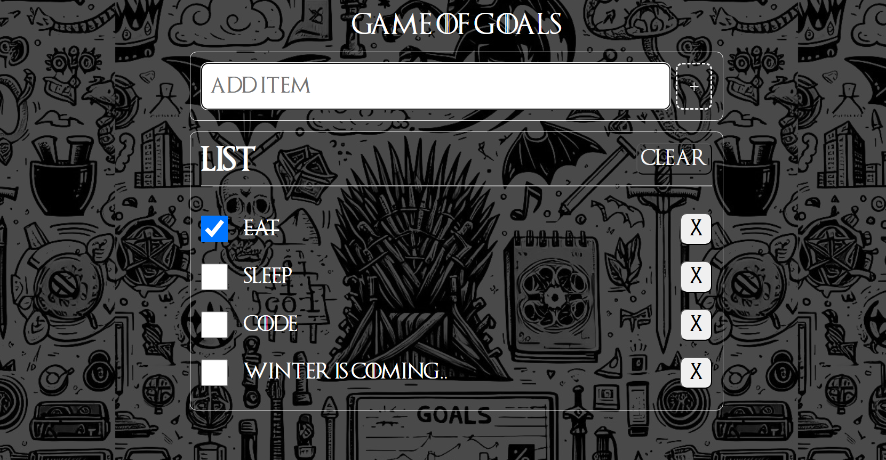

# Game-of-Goals

<h1 align="center">
  <br>
  
  <br>
  Game of Goals
  <br>
</h1>

<h4 align="center">A Game of Thrones themed To-Do list.</h4>


<p align="center">
  <a href="#key-features">Key Features</a> •
  <a href="#how-to-use">How To Use</a> •
  <a href="#credits">Credits</a> •
  <a href="#license">License</a>
</p>



## Key Features

- Engage in your to-do list with a Game of Thrones theme.
- Add, remove, and update tasks seamlessly.

## How To Use

To run this application locally, follow these steps:

```bash
# Clone this repository
$ git clone https://github.com/YOUR_USERNAME/game-of-goals.git

# Navigate to the project directory
$ cd game-of-goals

# [Include any additional steps for setup or configuration]

# Open the project in your preferred code editor
$ code .

# Run the project (include any specific command)
$ npm run dev
